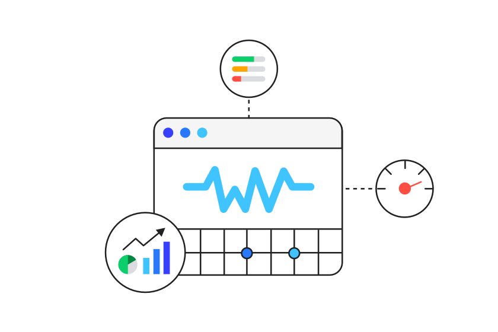
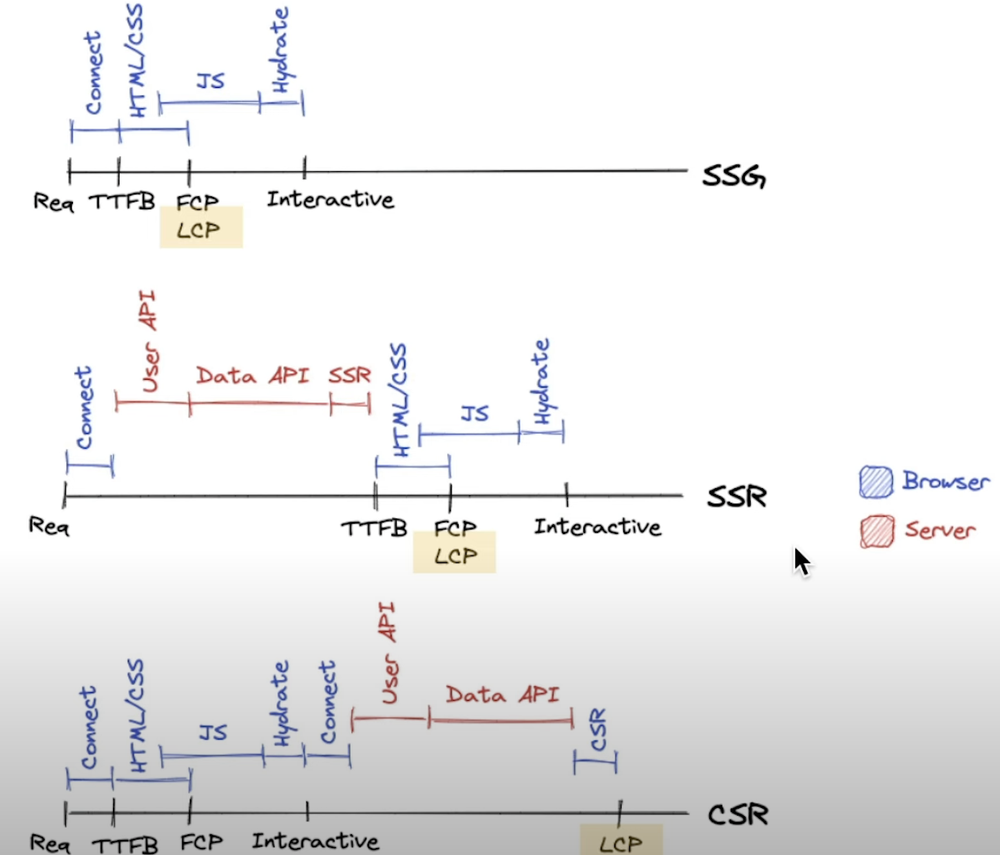
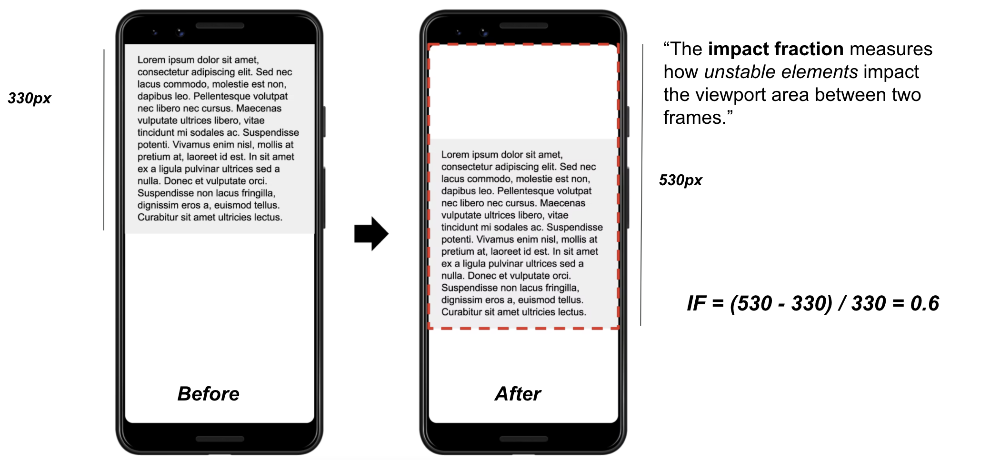
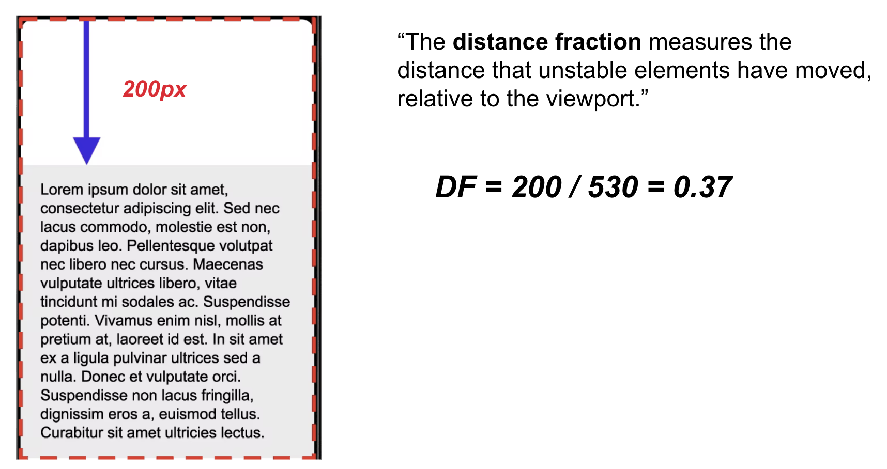

It's been almost six months since I joined Realtor.com, and the journey has been fascinating. Being in such a consumer-focused company, everything revolves around performance, optimization, and SEO. I thought of putting together a collection of strategies for optimizing Core Web Vitals (CWV) and creating crawler-friendly web pages.

## Introduction to Core Web Vitals

Core web vitals are a set of performance indicators that are used to measure the performance of a web page. Google and other search engines use these to determine the quality of a web page and apply their search rankings. As of now, we have 3 core web vitals:

- **Largest Contentful Paint (LCP)**

> This is the time it takes to render the first chunk of content on the page.

- **First Input Delay (FID)**

> This is the time it takes for the user to type in the first character of the page.

- **Cumulative Layout Shift (CLS)**

> This CWV measures the amount of pixels that are shifted from their original position.

While there are many other web vitals, the Google Engine weights these core web vitals in a bigger magnitude than the others. As such, I decided to create a collection of strategies for optimizing the core web vitals.

## Largest Contentful Paint (LCP)

Largest Contentful Paint is trying to measure the time it takes to render the first chunk of content on the page. This is done by measuring the time it takes to render the first chunk of content on the page. 

The most important factor which affects LCP is the rendering strategy by the webserver. Whether the server is rendered on the server (SSR), whether the page is statically exported (SSG) or the client renders it (CSR), the LCP will be different for each of these strategies. Have a look at the following image presented by Kara Erickson in [Vercel Conf 2021](https://www.youtube.com/watch?v=Nl4OwNhh2QI&t=760s):



Noticeably enough, SSG is the most performant strategy when considering LCP. When a page is statically exported, all it takes for a page to be rendered is requesting the page from the server, which normally would take under `100 milliseconds`.

In comparison, SSR and CSR (worst performing LCP strategy) have a much large difference in performance. These approaches require the server to render the page on the server and the client to run further computations that would further delay the page rendering. I would always recommend that whenever SSG is an option, to always try and use it.

## First Input Delay (FID)

First Input Delay is trying to measure the time it takes for the user to type in the first character of the page. A noticeable FID issue occurs when a user is trying to interact with an element of the web page (button, input, etc.) but the page is unresponsive. This is due to the main thread being occupied by other JavaScript tasks.

> The more JavaScript you are running, the higher the chance of bad score for FID.

The above statement might quite sound outragous at first. After all, frontend engineering is all about JavaScript. The above statement suggests that we reduce the amount of JavaScript on the main thread 🤯. There are mainly 3 ways of improving FID: 

> 1. Replacing JavaScript with CSS
> 2. Using (the correct) DOM API lifecycle methods
> 3. Running JavaScript on a background thread

### Replacing JavaScript with CSS
 
CSS is a truly amazing language! Diving deep into CSS, we can almost re-write a whole lot JavaScript code just with CSS. The power of CSS is that it's by default optimized for the browser. This means that the browser will execute the code in the most efficient way possible. While CSS is considered (by many) quite of a more *boring* language that developers use at the end of their tasks, it's truly sophisticated in its nature and quite underated for its capacities. [CSS for JS](https://css-for-js.dev/) is an excellent course that has a lot of great content and examples, in case you want to drill into CSS!

### Using (the correct) DOM API lifecycle methods

The DOM API has a lot of methods that can be used to manipulate the DOM. These methods are called lifecycle methods. These methods are called when the DOM is being manipulated. For example, when a new element is being added to the DOM, the `onMount` method is called. We could use such methods that hook into DOM lifecycle events:

- Rather than using scrollEvent (which triggers every single time the page is scrolled), we can use the the [IntersectionObserver API](https://developer.mozilla.org/en-US/docs/Web/API/Intersection_Observer_API). This API is a great way to detect when the user is scrolling the page. An example use-case would be the following:
  > When user scrolls the page, we want the navigation bacome sticky at the top of the page, and add a small shadow to the navigation bar
This can be achieved by both IntersactionObserver and scrollEvent. However, IntersectionObserver is more performant, as it runs on the background thread, resulting to much fewer method triggers as opposed to scrollEvent.

Here's a live example of how to use IntersectionObserver to create a sticky navigation bar:

<iframe height="300" style="width: 100%;" scrolling="no" title="Intersection observer  &amp; position: sticky" src="https://codepen.io/hey-nick/embed/mLpmMV?default-tab=html%2Cresult" frameborder="no" loading="lazy" allowtransparency="true" allowfullscreen="true">
  See the Pen <a href="https://codepen.io/hey-nick/pen/mLpmMV">
  Intersection observer  &amp; position: sticky</a> by Nick McMillan (<a href="https://codepen.io/hey-nick">@hey-nick</a>)
  on <a href="https://codepen.io">CodePen</a>.
</iframe>

The Intersection Observer is just one of the lifecycle events that can be used to hook into DOM events. The other many other lifecycle events that can be used, such as the [MutationObserver](https://developer.mozilla.org/en-US/docs/Web/API/MutationObserver), the [PerformanceObserver](https://developer.mozilla.org/en-US/docs/Web/API/PerformanceObserver), and so on. I highly suggest any JavaScript engineer to do a deep dive into the DOM API and learn about all the lifecycle events that can be used!

### Running JavaScript on a background thread

<!-- 

[hello!](~./images/adam-solomon-hello.jpg~ "adam solomon's hello”) -->

<figure>
  
  <figcaption>My precious Main Thread!</figcaption>
</figure>

Our thread is precious! After all, we have just one thread per browser tab, and if we don't use it correctly, it will lead to a devastating user-experience. We need to make sure that we utilize our thread as little as possible and only when we need it. I generally like the main thread to be occupied with render-critical tasks, and the background thread to be occupied with non-render-critical tasks.

Examples of render-critical tasks:
- Rendering the page
- Binding data to the DOM
- Executing a callback function used for user interaction

Examples on non-render critical tasks:
- Fetching data from the server
- Deferring non-critical CSS

Fortunately, there are a lot of ways to do this. One of the most common ways is to use [Web Workers](https://developer.mozilla.org/en-US/docs/Web/API/Web_Workers_API/Using_web_workers). A Web Worker is a JavaScript thread that runs in the background. It's a great way to run a task that doesn't need to be rendered on the main thread. By deferring the execution on the background thread, we can avoid overloading the main thread.

### Running performant JavaScript

Another form of releifing the main thread would be to running **optimal code**. You might wonder, what does that even mean? Is it something else, other than efficient algorithms, that we can do to increase our performance? Well, it's not always just about algorithms. It's about optimizing the JavaScript code, and that can be very well achieved from Web Assembly (WASM).

WASM is a portable, high-performance, and low-overhead language that can be used to run JavaScript code. It's a great way to run performant JavaScript code. For instance, take the following code:

```
function sum(a: number, b: number): number {
  return a + b;
}
```

Written in TypeScript, we run the code directly into the browser, by first compiling into JavaScript, and on the other version, using WASM to transpile into the binary code. Note that this can be easily achieved with [AssemblyScript](https://www.assemblyscript.org/), which is a bundler around TypeScript and WASM. A special shoutout to AssemblyScript, as it's a great way to compile TypeScript code into JavaScript code. This means that we don't need to utlize a different language (say Rust or C++) to compile our code into binary code, which is very handy for not switching between languages.

The outcome is staggering! The binary code is smaller, and the performance is almost **200 times (!) faster** than the original JavaScript code. While you might not always observe this improvement, it's expected that WASM will always be faster than JavaScript. One drawback of WASM as of yet, is that it's not applicable for DOM operations. For example, we can't use WASM to manipulate the DOM. While the team is still working on adding DOM support, WASM is excellent for utility functions that are used widely in our applications. One realistic usecase is parsing data/strings/urls etc. in our applications, or concatenating strings, and so on. 

Using WASM is a great way to reduce main thread usage, even if we are executing code in the main thread, due to how fast WASM code executes on the browser.
## Cumulative Layout Shift (CLS)

Cumulative Layout Shift is a CWV that measures the number of pixels that are shifted from their original position. CLS is derived from the following formula:

  >  **CLS = (Number of Pixels Shifted) / (Total Number of Pixels)**

- impact fraction: measures how unstable elements impact the viewport area between two frames. We can have a look at the following example:



In the example above, the initial viewport is `330 pixels` but the second frame is `530 pixels` after the first frame transition. The impact fraction is `0.6`. Note that the unit of measurement is a ratio of pixels.



- distance fraction: measures the distance that unstable elements have moved, relative to the viewport.

Since `530 px (total viewport) - 330 (initial viewport) = 200`, the distance fraction is `200` divided by the total viewport `(530)` = `0.37`.

From the following computations, we compute CLS

  > **CLS = IF * DF = 0.37 * 0.6 = 0.22**

Note that you don't have to run these computations yourself. Chrome already computes these by default; you can open the chrome web vitals panel by going in chrome dev-tools and hitting `cmd + shift + P`. A challenge that I am actively investigating is how to compute CLS in a headless pattern, through unit tests. In a realistic scenario, we want to make sure that we don't ship pages that have CLS issues. While there are tools (Sentry, NewRelic, etc.) that report CLS on the page, it's not always easy to find the culprit. That's because CLS occurs on page/component transitions.

One idea I am actively testing is utilizing the [PerformanceObserver](https://web.dev/cls/#measure-cls-in-javascript) in combination with a [chaos-monkey](https://netflix.github.io/chaosmonkey/)/[faker](https://github.com/marak/Faker.js/) tool to measure CLS in randomly generated scenarios. This would work like the following:

```
1. Performance Observer is Active
2. render the component and keep updating it with random props (chaos monkey)
3. Notice whether CLS > 0
```
A tool along these lines might have the potential to help us with re-assuring that we ship components without any CLS issues. This sounds like a reasonable way to test CLS, and I will be posting an update once I have a proof of concept!

## Conclusion

This post iterated among the 3 Core Web Vitals (LCP, FID and CLS) and created a collection of strategies for optimizing them. I hope it can help you in your journey to optimizing your web page. 

If performance and JavaScript optimization sounds fun to you, my team in [Realtor.com](https://www.realtor.com/) is always looking for new ways to optimize our user experience. From JS/TS, to Rust and AssemblyScript. 

Let's get in touch!