## Foreword

This article aims to help developers answer 2 questions: how and why would someone implement the design patterns. The main reference will be the legendary Gang of Four (GOF) book. The project showcased in this article is "Lexi", an open-source application for Android devices ([Google Play](https://play.google.com/store/apps/details?id=com.mkotsollaris.lexi), [Github](https://github.com/mkotsollaris/Lexi) and [Youtube](https://www.youtube.com/watch?v=FC_HQ-qM-mo)).
Let's start!

## Introduction

### What is a design pattern?

Design pattern is a description of standard/best practice solution for common/recurring Object Oriented Design problems. The design patterns are not invented. They are summaries of common solutions by experienced programmers using their best practices over time.
The design pattern are split into 3 categories:

- __Creational Patterns__: They abstract the instantiation process.
Structural Patterns: Concerned with how classes are related to each other (objects relationships).
- __Behavioural patterns__: Concerned with algorithms and the assignment of responsibilities between objects.

In this article, 18 out of the 24 design patterns mentioned in the GOF are described and showcased.

## 1. __Model-View-Controller (MVC)__ with the Observer pattern

This pattern is widely adopted by the most used frameworks (e.g., Java Spring, Ruby on Rails etc.). The core idea of MVC is to logically divide the main components of the program into three parts: Dataset (Model), UI (View) and Application logic (Controller). By following the MVC pattern the code becomes more readable and reusable. The main part of MVC is the Observer pattern, which is an interface with 1 method:

```
interface Observer
{
    void update();
}
```

Then, we can trigger update simultaneously for all of the MVC components. For more specifications on how to implement MVC, [read more here](https://www.techyourchance.com/mvp-mvc-android-1/).

## 2. Singleton

This pattern allows an object to be instantiated only 1 time at the runtime of the program. This is rather useful useful when an object is expected to be shared across different classes. Another benefit would be the initialization cost (speed or memory) of the object. An implementation of the Singleton would be the following:

```
public class CustomCharacterFlyweightFactory
{
    //the instance which holds the flyweight
    private static CustomCharacterFlyweightFactory instance;

    public static CustomCharacterFlyweightFactory getInstance()
    {
        if(instance == null) instance = new CustomCharacterFlyweightFactory();
        return instance;
    }

    private CustomCharacterFlyweightFactory()
    {
        for(int i = 0; i < characters.length; i++)
        {
            customCharacterPool[i] = new CustomCharacter(characters[i]);
        }
    }
}
```

Simply making the constructor private and defining a private static object of the same class would be the tasks for someone to follow in order to implement the Singleton pattern.

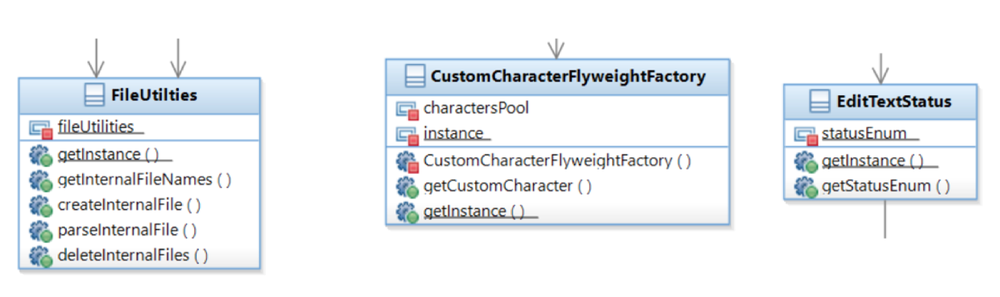

## 3. Builder
Instead of initializing the object at once, we can create an object part-by-part. That's what the builder pattern states. There are many ways of implementing this pattern. In this example, I am following Bloch's implementation of the Builder pattern ([Bloch, 2008; Effective Java](https://books.google.ca/books/about/Effective_Java.html?id=ka2VUBqHiWkC)).

```
class CompositeBuilder
{
    //stores the composites (RowComposites and CustomCharacters)
    private Stack<RowComposite> compositeRowStack = new Stack<>();

    CompositeBuilder()
    {
        compositeRowStack = new Stack<>();
    }

    /**
     * Adds the new character to the RowComposite. If the RowComposite does not exist, then it's
     * created. In case of the same charPosition, the value replaces the old one.
     *
     * @param customCharacter the CustomCharacter
     * @param fontFace        the FontFace
     * @param fontSize        the FontSize
     * @param rowNumber       the row number
     * @param charPosition    the position where the character will be inserted
     */
    void buildCharacter(CustomCharacter customCharacter,
            FontFace fontFace,
            FontSize fontSize,
            int rowNumber,
            int charPosition)
    {
        if(compositeRowStack.size() == 0)
        {
            buildRowComposite(0);
        }
        if(customCharacter.getChar() == '\n')
        {
            buildRowComposite(rowNumber);
        }
        else
        {
            compositeRowStack.get(rowNumber)
                    .addChild(customCharacter, fontFace, fontSize, charPosition);
            setFonts(rowNumber, fontFace, fontSize, charPosition);
        }
    }

    /**
     * Sets new fonts to the CustomCharacter.
     *
     * @param rowNumber    the row number
     * @param fontFace     the FontFace
     * @param fontSize     the FontSize
     * @param charPosition the position where the character will be inserted
     */
    void setFonts(int rowNumber, FontFace fontFace, FontSize fontSize, int charPosition)
    {
        RowComposite rowComposite = compositeRowStack.get(rowNumber);
        rowComposite
                .setFontFace(fontFace.getFontFaceType(), fontSize.getFontSizeType(), charPosition);
    }

    /**
     * Creates a new row and adds it last in the stack.
     */
    void buildRowComposite(int rowNumber)
    {
        RowComposite rowComposite = new RowComposite(rowNumber);
        compositeRowStack.push(rowComposite);
    }
}
```

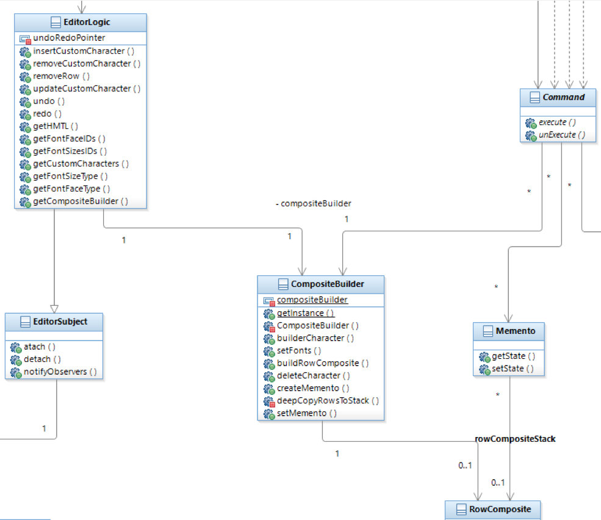

## 4. Abstract Factory

Have class hierarchies to instantiate the logical hierarchies. Abstract factory uses the factory-classes to instantiate objects, without the clients having to modify code. In the following example, the FontFaceFactory and FontSizeFactory classes extend from the FontAbstractFactory class which implements the Abstract Factory pattern:

```
public abstract class FontAbstractFactory
{
    abstract FontFace createFontFace();
    abstract FontSize createFontSize();
}
public class FontFaceFactory extends FontAbstractFactory
{
    @Override FontFace createFontFace()
    {
        return new FontFace(FontFace.FontFaceType.SERIF);
    }

    @Override FontSize createFontSize()
    {
        return null;
    }
}
public class FontSizeFactory extends FontAbstractFactory
{
    @Override FontFace createFontFace()
    {
        return null;
    }

    @Override FontSize createFontSize()
    {
        return new FontSize(FontSize.FontSizeType.NORMAL);
    }
}
```

## 5. Factory Method
The factory pattern is a _creational pattern_. It can be implemented by having abstract methods within the class that are meant to create objects. This is an object-based pattern whereas, the abstract factory, was a class-based pattern since it required new classes to be defined. The Component class contains the createComponentObject method which implements the Factory method pattern.

```
abstract class Component implements VisitorAccepter
{
    abstract Component createComponentObject();

    public void addChild(Component rowComponent)
    {
    }

    public void removeChild(int index)
    {
    }

    public Component getChild(int index)
    {
        return null;
    }

    public int childrenNumber()
    {
        return 0;
    }
}
```

## 6. Prototype

This pattern is a creational pattern and it allows shallow or deep copy of an object. The implementation of this pattern is very straightforward and it can be achieved by either overriding object's clone method or by creating a new function (e.g., cloneMe).

```
import java.util.ArrayList;

/**
 * Represents a Row. Saves the extrinsic state of the CustomCharacter (FontFace and FontSize).
 */
class RowComposite extends Composite
{
    /**
     * Implements the Prototype Pattern; uses Deep cloning.
     */
    RowComposite cloneMe()
    {

        ArrayList<FontFace.FontFaceType> fontFaceListCopy = new ArrayList<>();
        ArrayList<FontSize.FontSizeType> fontSizeListCopy = new ArrayList<>();
        for(int i = 0; i < fontFaceList.size(); i++)
        {
            fontFaceListCopy.add(fontFaceList.get(i));
            fontSizeListCopy.add(fontSizeList.get(i));
        }
        ArrayList<Component> childrenArrayListCopied = new ArrayList<>();
        for(int i = 0; i < childrenArrayList.size(); i++)
        {
            childrenArrayListCopied.add(i, childrenArrayList.get(i));
        }
        return new RowComposite(rowNumber, childrenArrayListCopied, fontFaceListCopy,
                                fontSizeListCopy);
    }
}
```

## 7. Composite

The composite pattern allows the implementation of logical-tree hierarchies. In this case, each row has a set of CustomCharacters, as it can be seen below:

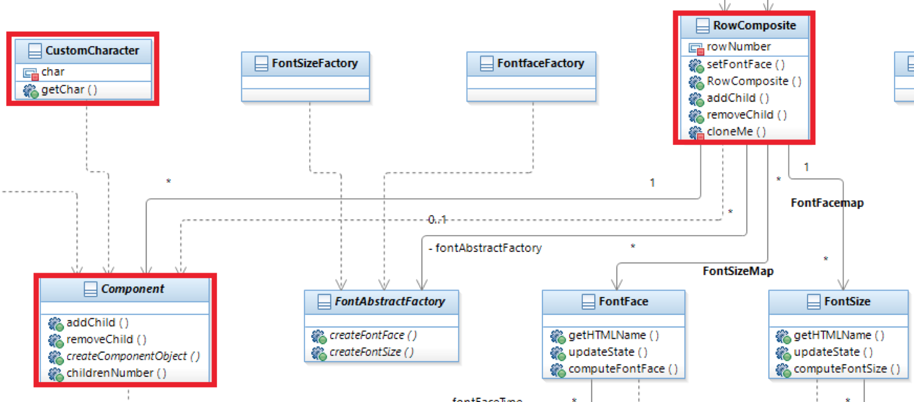

## 8. Decorator

This pattern allows decoration of the objects' properties. For instance, creating an activity with and without a border.

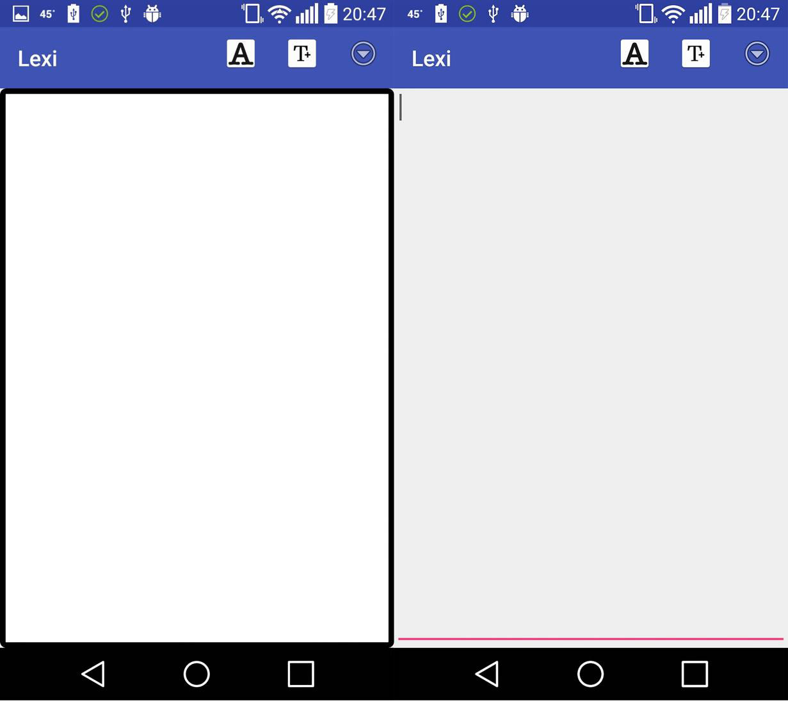

## 9. Flyweight

This is one of my favorite design patterns. [As I mention in this answer in Software Engineering](https://softwareengineering.stackexchange.com/questions/108630/does-anyone-have-a-specific-example-of-using-the-flyweight-pattern/347054#347054), the purpose on using the flyweight pattern is to avoid unnecessary object initialization and thus save space. As defined by GOF, an object can have two states, the intrinsic and the extrinsic state:

1. __Intrinsic state__: Is stored in the flyweight; it consists of information that's independent on the flyweights context, thereby making it shareable.
2. __Extrinsic state__: depends on and varies with the flyweight's context and therefore cant be share. Client objects are responsible for passing extrinsic state to the flyweight when it needs it.

The CustomCharacter object gets instantiated using the Flyweight pattern. The CustomCharacter intrinsic state (char) is stored in the CustomCharacter and the existrinstic state (FontFace and Fontsize) is stored on the RowComposite. The FlyweightFactory contains the pool of the available characters that the user can insert.

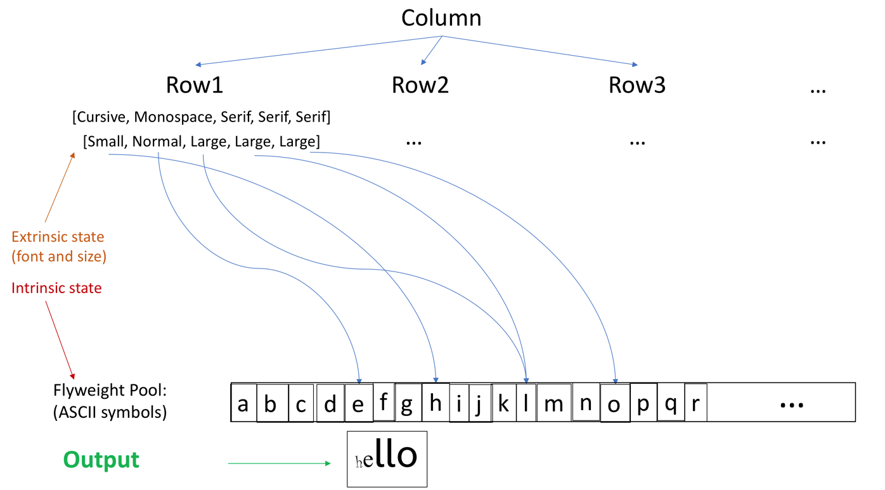

## 10. Adapter

The CommandAdapter class implements the GOFList interface and it composes the Java ArrayList class.

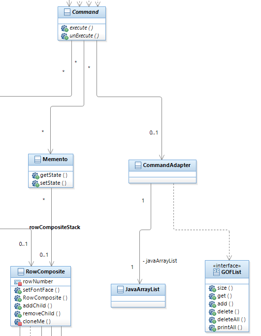

## 11. Facade

Very straightforward and useful pattern. Simply encapsulate the behavior and have a service work as a gateway between the client and the system.

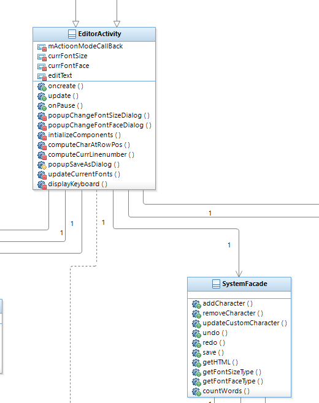

## 12. Proxy

The ColumnCOWProxy implements the Copy-on-write proxy for the Column class. Whenever a client changes the number of column, then a new Column object is created and returned, while the original object remains the same.

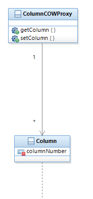

## 13. Iterator

Super useful pattern, as it is implemented in all the common data structures used (e.g., java.util.List); the iterators allows traversing a logical hierarchy of a class. The CharacterIterator implements the Iterator pattern and iterates through the leafs (CustomCharacters) of the composite pattern.

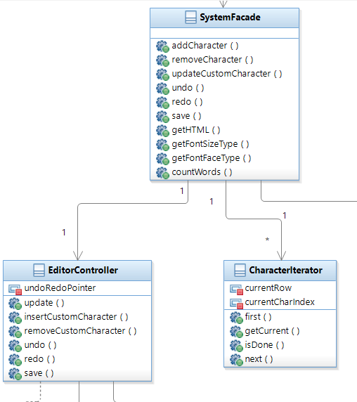

## 14. Visitor

The visitor's purpose is to implement a specific functionality (e.g., compute the total sum of a tree). The Component impements the VisitorAccepter interface and the whenever a CustomCharacter is visited, then a counter is increases in the CharacterVisitor object which implements the Visitor pattern. This allows the count of the characters within the view.

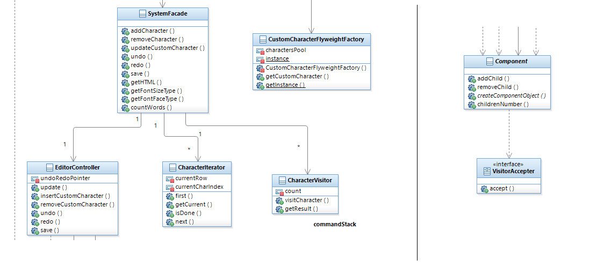

## 15. & 16. Command & Memento

The command pattern translates the user's actions into programmable actions. The InsertCharacterCommand, DeleteCharacterCommand and UpdateCharacterCommand implement the Command interface. undo/redo is supported through these commands by storing increasing/decreasing the pointer in the command stack.

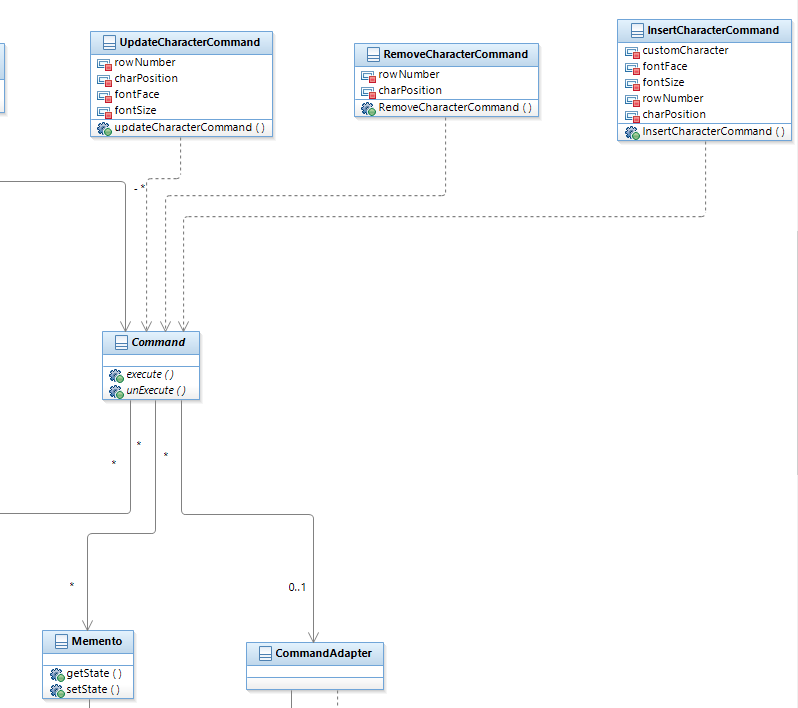

The Memento pattern simply stores the state of the object in order to allow undo/redo operations. The Memento class gets and sets the state of the Composite and thus implements the Memento pattern.

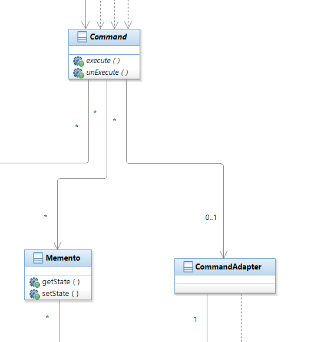

## 17. Observer

The Observer is used as an event scheduler that gets triggered whenever an event (e.g., click) occurs. The EditorObserver in collaboration with EditorSubject and EditorLogic implement the Observer pattern.

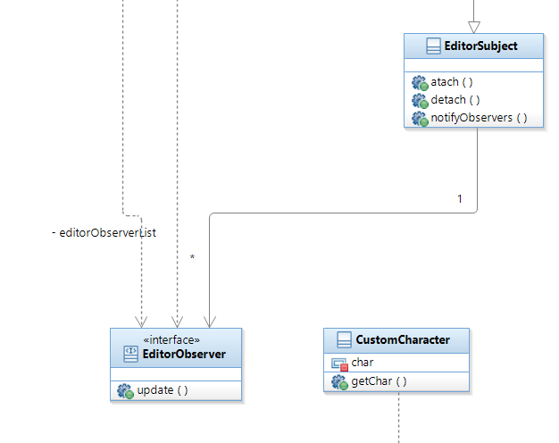

## 18. State

This pattern helps The FontSize and FontFace classes and the FontListener interface implement the State pattern.

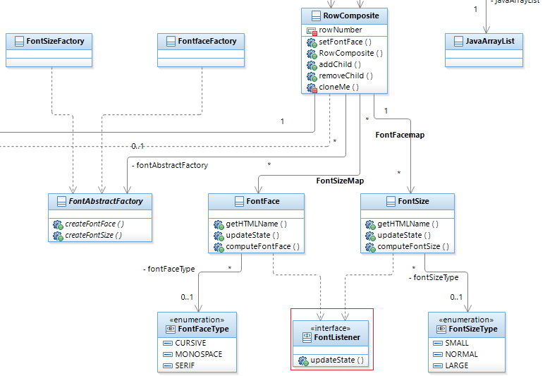

### Final Thoughts

Design patterns are used in any major framework. Without concise and reusable structure, projects cannot be scaled. Design patterns cannot be invented and forced. We, the developers, have to learn them and apply them, whenever suitable. Lexi offers a _robust_ example of how the design patterns can be used to build a modern application.
It is my hope that I explained the complex concepts of the design patterns in a clear way.

## The complete UML Diagram

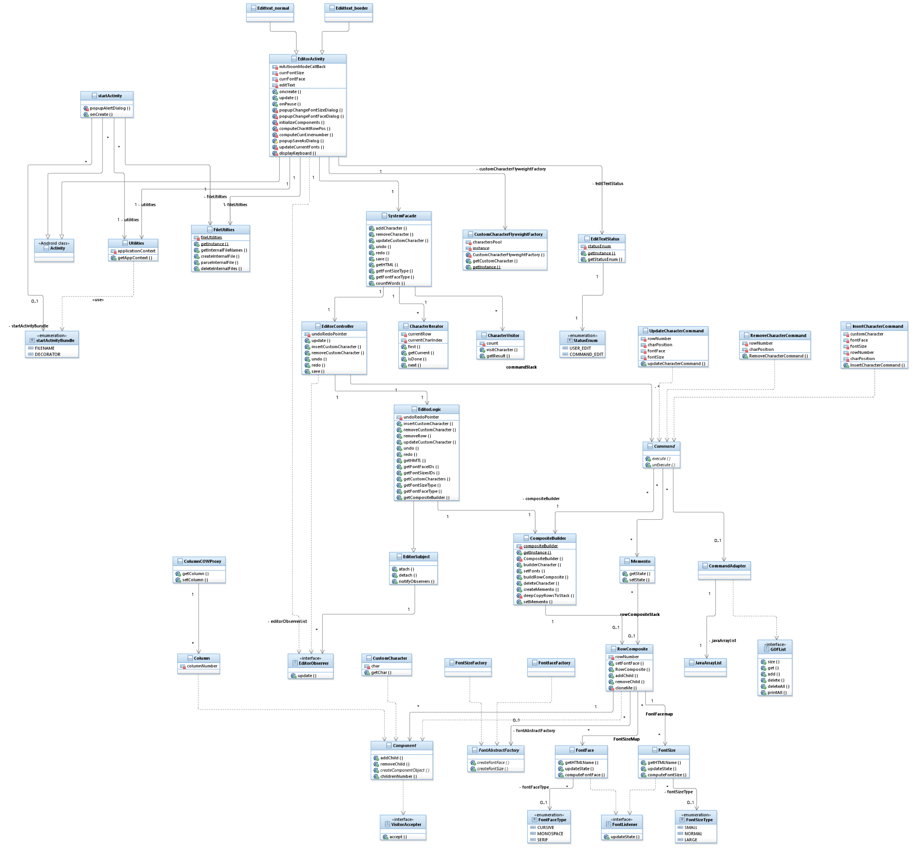

Lexi can be found at [Github](https://github.com/mkotsollaris/Lexi), [Google Play](https://play.google.com/store/apps/details?id=com.mkotsollaris.lexi) and YouTube ([full](https://www.youtube.com/watch?v=FC_HQ-qM-mo) & [short version](https://www.youtube.com/watch?v=fplVgI2RVQg&t=1s)).

Thanks for reading! 🙏

## Acknowledgements

I would like to sincerely thank [Dr. Weichang Du](https://www.cs.unb.ca/~wdu/) for helping me learn the design patterns.