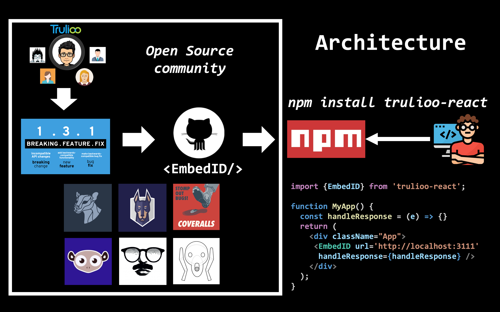
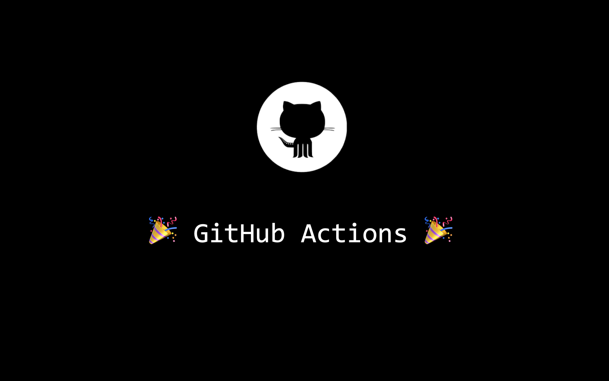

A few days ago I presented this topic in [DevWeekATX](https://twitter.com/devweekatx) and there were several individuals who requested me to write a blog; this is it! 🚀

>Any application that can be written in JavaScript, will eventually be written in JavaScript.
>Jeff Atwood

Javascript's high growth has reshaped the open-source community. NPM has made it easier than ever to create and reuse open source libraries through the JavaScript ecosystem. As the open source community gets bigger and bigger, I will try to address the key points that construe a successful open source project.  This post is based on the implementation of [trulioo-react](https://github.com/Trulioo/trulioo-react) aka EmbedID 🆔👇

## Signs of a healthy open source library

#### What problem are you solving?
Regardless of the underlying engineering principles, any application has to be needed by the community to render successful. If we were to implement an application perfectly (engineering wise) but with no real use, it would be impossible for the application to be successful. Investing some time on this prior to jumping into implementation would be a good decision and your future self will thank you in spending more time spec'ing your product prior jumping to implementation 🙊.

#### Is it well implemented?
The community is your customer. How many open issues to you have? Have you established open communication in regards to who can contribute to the project and how you should version your SDK/API? Is your API well tested? 100% test coverage would be a good start for starters 🏁

## Deciding on Versioning Methodology
This is an opinionated section as there are multiple methodologies for applying different types of versioning. Let's compare the 2 most standard ones, Semantic Versioning versus Calendar Versioning:

#### Semantic Versioning


This is what I use for EmbedID and what most of the libraries in NPM. The way [Semantic Versioning](https://semver.org/) works is very simple; did the change you just commit introduce:

1. a bug fix? -> upgrade minor number
2. a feature (still maintaining backwards compatibility)? -> upgrade middle number
3. a major upgrade (backwards incompatible)? -> upgrade major number. You can think of Angular (1.0 -> 2.0), Python 2.7 -> 3.0 and so on.

#### Calendar Versioning

Very straightforward way of [doing versioning](https://calver.org/). An example of a release could be `release_2019_11_15`, if you were to release in 2019 on November the 15th. An important drawback of this methodology when compared with `semver` is that there is no inclusive way to convey what changes occurred to your API, other than a _good-ol_ changelog. Regardless of this drawback, this is a very popular convention and it is used amongst several companies, including [Plaid].

### Provide Visibility in your code and your dependencies
What's your test coverage? How many dependencies do you have? Are you sure you are using all of your dependencies? Are there any potential vulnerabilities into your codebase and what's your code quality?

Yes, code quality can be significantly increased over code reviews, but code reviews alone cannot keep track of all the aforementioned. Allow me to introduce you the following, which once integrated, run on every single commit you introduce:

- [Snyk.io](https://snyk.io/): detects codebase vulnerabilities.
- [Lgmt](https://lgtm.com/): performs static analysis within your codebase and grades your code; throws alerts when your code degrades. Legitimate!
- [Fossa](https://fossa.com/): checks whether your dependencies are compliant with your license.
- [BundlePhobia](https://bundlephobia.com/): reports how much JavaScript (KB/MB and _hopefully __not__ GB_) are you delivering to the end user.
- [David-dm](https://david-dm.org/): are your (direct, dev, peer) dependencies up to date?
- [Coveralls.io](https://coveralls.io/): Visualize and badgify your test coverage! Here's an example of how coveralls would visualize [trulioo-react's tests](https://coveralls.io/github/Trulioo/trulioo-react)
- [Probot](https://probot.github.io/): Automatically opens PRs (and if given permission, merges) based on potential known security vulnerabilities.

Best part? All of these integrations are 🆓 for open source projects 🎉

This how the architectural flow looks from EmbedID, end to end:



That's great. But there is one thing that I haven't really mentioned. How do we do continuous integration and continuous delivery? And everytime we merge on master, how do we let npm know about our new version? 

It's time for action... Time for GitHub Actions! 🎬🏃‍

## Github Actions



#### What are github actions?

GitHub actions are a way to automate certain parts of our pipelines, including CI/CD, autonomous workflows, automated testing and so on. 

So why should we get excited 🤔? After all, there are tons of tools that would allow continuous integration (travis CI, circleCI an so on) which work perfectly fine. Here are a few reasons to get HYPED 😲

1. YAML syntax 
2. Github Actions are very handy because they are integrated in our version control out of the box.
3. [GitHub Marketplace](https://github.com/marketplace)🚀 adds the ability to reuse various integrations out of the box!

While #1 and #2 are nothing new to the CI/CD world, #3 offers a tremendous capability to reuse various integrations from different vendors in a very different fashion than what we've seen before. So let's try to integrate with coveralls.io and let's assume that we are about to automate the 'Build' workflow:

1. Go to [Coveralls' github action](https://github.com/marketplace/actions/coveralls-github-action).
2. Install coveralls in your repo
3. Add the following into your workflow file (`.github/workflows/build.yml`):

```
name: Build

on: [push]

jobs:
  build:
    runs-on: ubuntu-latest # OS docker image 

    strategy:
      matrix:
        node-version: [12.x] # array of the nodejs versions we support

    steps:
      - name: Coveralls Parallel
        uses: coverallsapp/github-action@master
        with:
          github-token: ${{ secrets.github_token }}
          parallel: true
          path-to-lcov: ./coverage/lcov.info

      - name: Coveralls Finished
        uses: coverallsapp/github-action@master
        with:
          github-token: ${{ secrets.github_token }}
          parallel-finished: true
        env:
          CI: true
```

In this particular case, Coveralls requires 2 steps. The tests execute on the first step and the second step is triggered when the tests are finished. Note that this can be also done in one single step, but it comes with a drawback of the process being hung until tests complete. This is how the standard version looks:

```
- name: Coveralls
  uses: coverallsapp/github-action@master
  with:
    github-token: ${{ secrets.github_token }}
```

You can view the [Build workflow](https://github.com/Trulioo/trulioo-react/actions) in `trulioo-react` repo 👾.

## A github action for publishing?
Since we are applying semver into out application, we know exactly when to publish. Sure we can do this process manually, and most certainly mess up the version numbering, incorrectly publish outdated products and whatever else could possibly go wrong when it comes to human errors 🙈. Or, we could use a publish action to automate the whole thing!

### semantic-release and commitizen to the rescue:
If you haven't used them before, you are about to step up your whole automation game 📈

- [commitizen](https://github.com/commitizen/cz-cli): user-friendly CLI which is used instead of `git commit` and prompts certain questions which are used to determine the next version alongside with your changelog.md (yes, you are reading this right. It __generates the changelog__ for you)
- [semantic-release](https://github.com/semantic-release/semantic-release): a tool meant for your CI. Following formalized conventions for commit messages, semantic-release automatically determines the next semantic version number, generates a changelog and publishes the release. This process is done on every single commit.

So, the next step is to create a workflow that triggers everytime we push on master and checks for the last commit. Then calls `semantic-release` and if it finds a new version, tags and releases the package in both github and npm.

Before seeing the solution, you can try figure it out on your own on how you can write the worfklow for this automation ❗️

`publish.yml`

```
name: Publish

on:
  push:
    branches:
      - master

jobs:
  release:
    name: release
    runs-on: ubuntu-latest
    steps:
      - uses: actions/checkout@v1
      - uses: actions/setup-node@v1
        with:
          node-version: "12.x"
          registry-url: "https://registry.npmjs.org"
          GH_TOKEN: ${{ secrets.GH_TOKEN }}
          NPM_TOKEN: ${{ secrets.NPM_TOKEN }}
      - run: npm config set '//registry.npmjs.org/:_authToken' "${{ secrets.NPM_TOKEN }}"
      - run: npm whoami
      - run: npm ci
      - run: npm run test -- --coverage src/tests/snapshot src/tests/unit
      - run: npm run semantic-release
```

We have just achieved full automation for safely publishing our SDK in both github and npm, not bad!
Note: Don't forget to generate a token from NPM and store it in your secrets in github. This is how you authenticate yourself to `npm`.

## Things I learned the hard way 😢

Here's a list of a couple of gotchas that I learned the hard way and I think they could help you in your JavaScript journey; have a look at the following npm commands that could sit in your `package.json`:

1. `"transpile": "babel src -d ./dist --ignore **/tests/"`: Whenever you are creating JavaScript SDKs, you are responsible for delivering executable JavaScript in a cross-browser minimized format to the client. It is highly unlikely that your clients don't need your tests or other files into their `node_modules`. If they need to execute your tests, they would most likely `git clone` your project and run the tests, thus make sure that your tests are not included in the deliverable javascript.
2. `"preversion": "npm test`: This phenomenal npm command runs right before `npm publish` (which is automatically triggered through semantic-release). If the tests fail, then the process will exit without executing `npm publish`.
3. `”files": [”dist”]`:  If there is one command that __you should know, `files` should be it__. `files` whitelists the folders/files that will be delivered to your end-users. npm has a blacklisting capability through `.npmignore` but I advice against. Why? `.npmignore` needs to be continuously updated as the project grows, so whichever files you are adding, you will have to be constantly updating your `.npmignore`. There's also another gotcha. `.npmignore` will ignore your `.gitignore`, which means that _unless_ you declare the files in `.npmignore`, files will be committed in `npm`. So can you imagine what happens when you have declared your `.env` in `.gitignore` but not in `.npmignore` 🙀? Exactly... you just leaked your `.env` files which contains all your credentials to npm. Whitelisting is much easier than blacklisting, and I would highly suggest you take that approach early on on your project.

## Summary

1. We were able to deploy our application utilizing GitHub actions.
2. We integrated with multiple third parties (snyk.io, lgmt, fossa, coveralls.io) to increase codebase quality
3. Integrated `npm` and github to allow seamless publishing through `semantic-release` and `commitizen`.
4. Deliver 📦 a well maintained product to the client.
5. 👋 Encourage other developers to participate into development utilizing the latest 🆕 technologies!

 I ♥ JavaScript and GitHub!

 Related: [Find my aftermath podcast right here 🎧.](https://www.briefs.fm/menelaos-kotsollariss-podcast/9)