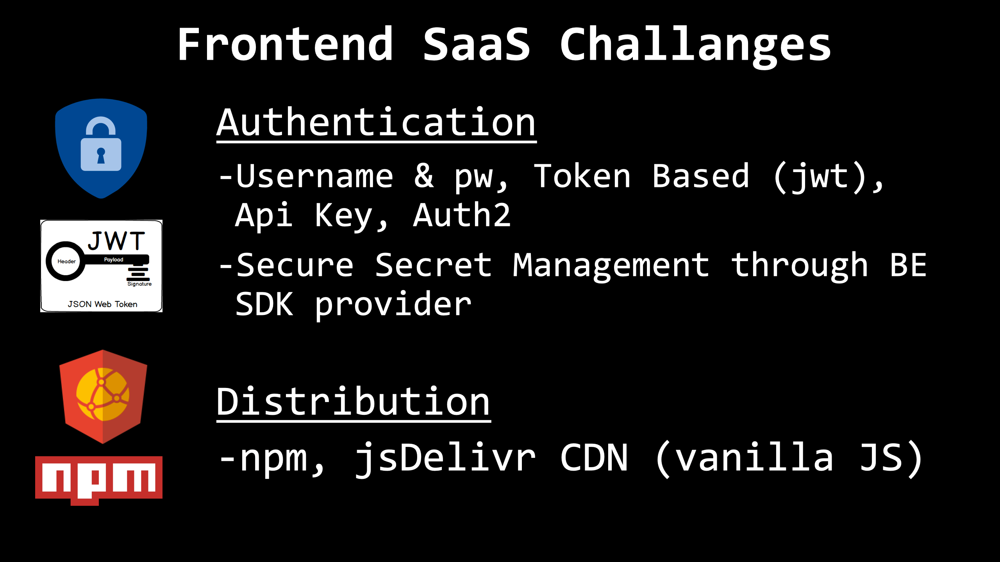
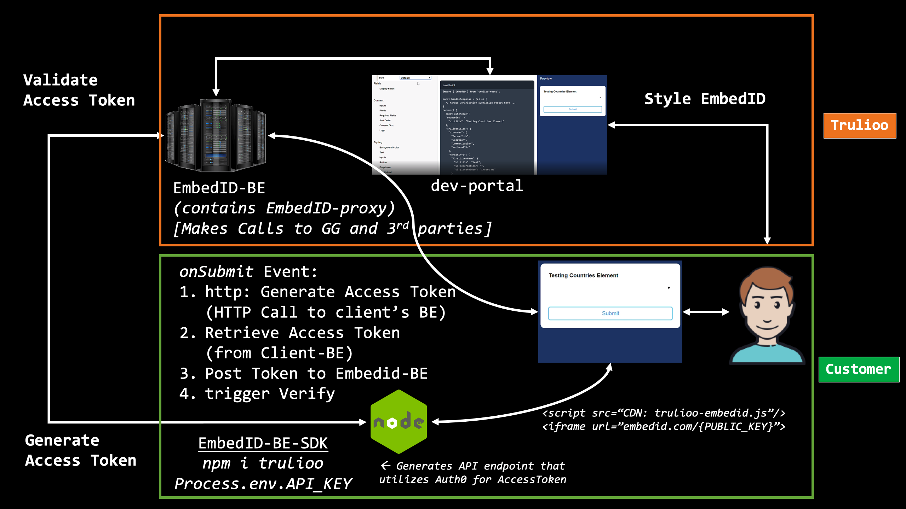
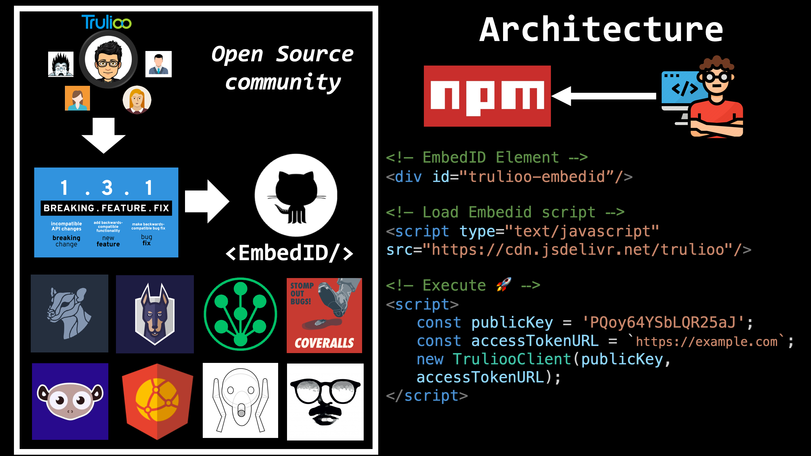

> Note: This article is still work in progress.
> My presentation on [DeveloperWeek 2020 in San Francisco](https://developerweek2020.sched.com/event/YYR5) will be based on this article 👾.

More often than not, developers distribute software meant for other developers. While there are several successful projects in the community, the majority of the solutions fail to be adopted by others. In this post, I will try to analyze what renders a successful SaaS project and what patterns need to be followed by us, the developers, to increase our likelihoods to success. 

> How to make developers integrations easier?

Having reached to an impressive scale as a startup, [my company Trulioo](https://www.trulioo.com/), traditionally, perfected the API integration and offered a wide range of impressive features. You can think of Twilio API, but for Identify Verification purposes. Having a powerful API can definitely set you miles away from your competitors, but arguably, that alone doesn't necessarily make developers' lives easier, and this article I am going to explain why and showcase techniques to enhance the way you distribute software.

# Software as a Service (SaaS)

Typically this is software by a third party which you use within your infrastructure. The most common way of SaaS is API integration, while an emerging way is by a package registry in a frontend form. [Stripe Connect](https://stripe.com/en-ca/connect), [Plaid Link](https://plaid.com/docs/quickstart/) and so on are some of the package-registry ways of integration for frontend applications.

When deciding which way is more suitable for your software, answering the following question will help you guide through:

> Is my integration meant for User Interfaces, or is it meant for backend systems?

For instance, Stripe has a very straightforward product and customers are expected to utilize them in websites most of the time, thus having an API instead of a frontend component wouldn't make much sense for more of the cases. Stripe has an API that supports clients who prefer to integrate with their own UI, but majority of the use-cases would be expected to use Stripe-Connect.

This is an excellent way to decide on what to implement first: is your product meant for frontends? Then start with a Stripe-like approach, else follow the Twillio API path 😃.

# Micro Frontends

A relatively new term, [Micro-Frontends](https://micro-frontends.org/) is a different way of developing websites.


While backend systems have evolved tremendously in the last years with docker, serverless and the excellent microservices architecure, the same cannot be said for frontend applications. The frontend community has made tremendous advancements when it comes to building fantastic libraries and frameworks that makes it easier than ever to build, test and deploy new web applications. Libraries like React, Vue, Redux are just some examples of the plethora of the awesome libraries which reside in the npm-land.

That is great. But what about addressing our frontend application size? Could we take the learnings from the monolith backend applications and apply them to our contiguously growing complex frontend applications?

> Micro-frontends is a microservices-like architecture that applies the concept of microservices to the browser side. Transforming to a mono-like applications from a single, single application to an application that combines multiple small front-end applications. Each frontend application can also be standalone run, independent development, standalone deployment.

While there is a lot of depth when it comes to someone wanting to apply micro-frontend implementation, the idea is quite straightforward: Break down each page to sub-page which can be ran individually and independently from others.

# SaaS Microfrontends

Micro-frontends have several advantages when it comes to SaaS Delivery.



## Authentication
While you are implementing your frontend service, you need to remember that you are implementing for the user's browser and consequently you can't expose sensitive information, including username, passwords, API keys nor user's personal identity information (PII).

> Storing secrets occurs on backend

There has to be a backend on user's infrastructure which stores credentials and runs different tasks; potentially even serving the whole website. A client-backend-sdk can be developed in order to integrate with client's infrastructure. There is a drawback to that which should be quite clear 🤔 --> backend sdks have to be written in whichever language clients ran with. This means that we would have to implement quite a few programming languages when client base grows.

A good starting point is to pickup the language that is most likely to be picked up by your early adopter; or even your existing customers. Having EmbedID as an example, every of the following components has the following meaning in this microftontends architecture:

- [`trulioo-embedid-client`](https://github.com/Trulioo/trulioo-embedid-client): script to be included by the client. Required code snippet should look like something between these lines:
```
<div>EmbedID</div>
<div id="trulioo-embedid"></div>
<script type="text/javascript" src="https://cdn.jsdelivr.net/gh/trulioo/trulioo-embedid-client@master/v1/main.js"></script>
<script>
  const publicKey = 'PUBLIC_KEY_HERE';
  const accessTokenURL = 'ACCESS_TOKEN_ENDPOINT_URL';
  new TruliooClient(publicKey, accessTokenURL);
</script>
```
- [`trulioo-embedid-node`](https://github.com/Trulioo/trulioo-embedid-node): backend sdk to generate JWT that are consumed from the client.
```
require('trulioo-embedid-node')(app);
```
- `embedid-backend`: REST API backend system to be producing and validating tokens as well as serving application by user configuration.

For example, `trulioo-embedid-node` is an express middleware which streamlines access generation token which is used for authentication purposes via `trulioo-embedid-client` (I am explaining what this part does here). The purpose of `trulioo-embedid-node` is the following:

> abstract the need to authenticate users by simplifying access token consumption

There are several ways to authenticate an user. The most commonly used ones are:

- username, password (basic authentication)
- API_KEY
- Auth2 (utilizing a different vendor's credentials to sign on behalf of them)
- JWT

Since the client needs to know whether the request is properly authenticated, we could use a JWT approach where a token is generated and used for authentication purposes. To enhance the security, we could also expire the token after it is used for a single verification, transitioning the token to "One Time Access Token". The whole workflow can be summarized through this diagram:



## Distribution

### [jsDelivr](https://www.jsdelivr.com/)

We have developed our services, great! Time to publish them. For the client, we need to host it in a CDN as clients are distributed around the world and we would want to minimize the time required to retrieve the required HTML/JS. JSDelivr offers a very handy and out of the box way of CDN-izing github packages. This is the URL, based on your github package:

`https://cdn.jsdelivr.net/gh/${USERNAME}/${REPO_NAME}@${BRANCH}${FILENAME}`

For instance, if I wanted to retrieve `src/index.js` file, from `master` branch of `trulioo-embedid-client`, I would have to request for the following file:

`https://cdn.jsdelivr.net/gh/trulioo/trulioo-embedid-client@master/src/index.js`

### [npm](https://www.npmjs.com/)

For products meant to be consumed not directly from the browser, package registries like npm are a great choice, because of the ease of use and simplicity to integrate with javascript libraries. Publishing npm libraries is also easy and fun(!) [to automate](https://menelaos.dev/devweek-atx/); see [trulioo-embedid-node](https://www.npmjs.com/package/trulioo-embedid-node) live in npm, following fully automated semver for package versioning.

## Summary

We were able to build a full SaaS frontend tool where we applied microfrontends and microservices approach. While this is an early stage of the development and active customers are just starting to grow, it will be interesting to see how the application will behave as the project grows. Here is a summary of the repos mentioned here:

- EmbedID Portal: [https://gateway-admin.trulioo.com/](https://gateway-admin.trulioo.com/) (grab your API key!)
- trulioo-embedid-client: [github](https://github.com/Trulioo/trulioo-embedid-client) and [CDN](https://cdn.jsdelivr.net/gh/trulioo/trulioo-embedid-client@master/)
- trulioo-embedid-node: [github](https://github.com/Trulioo/trulioo-embedid-node) and [npm](https://www.npmjs.com/package/trulioo-embedid-node)
- trulioo-embedid: [github](https://github.com/trulioo/trulioo-react) and [npm](https://www.npmjs.com/package/trulioo-react)



Try it on your own and give me a shout! 🔊