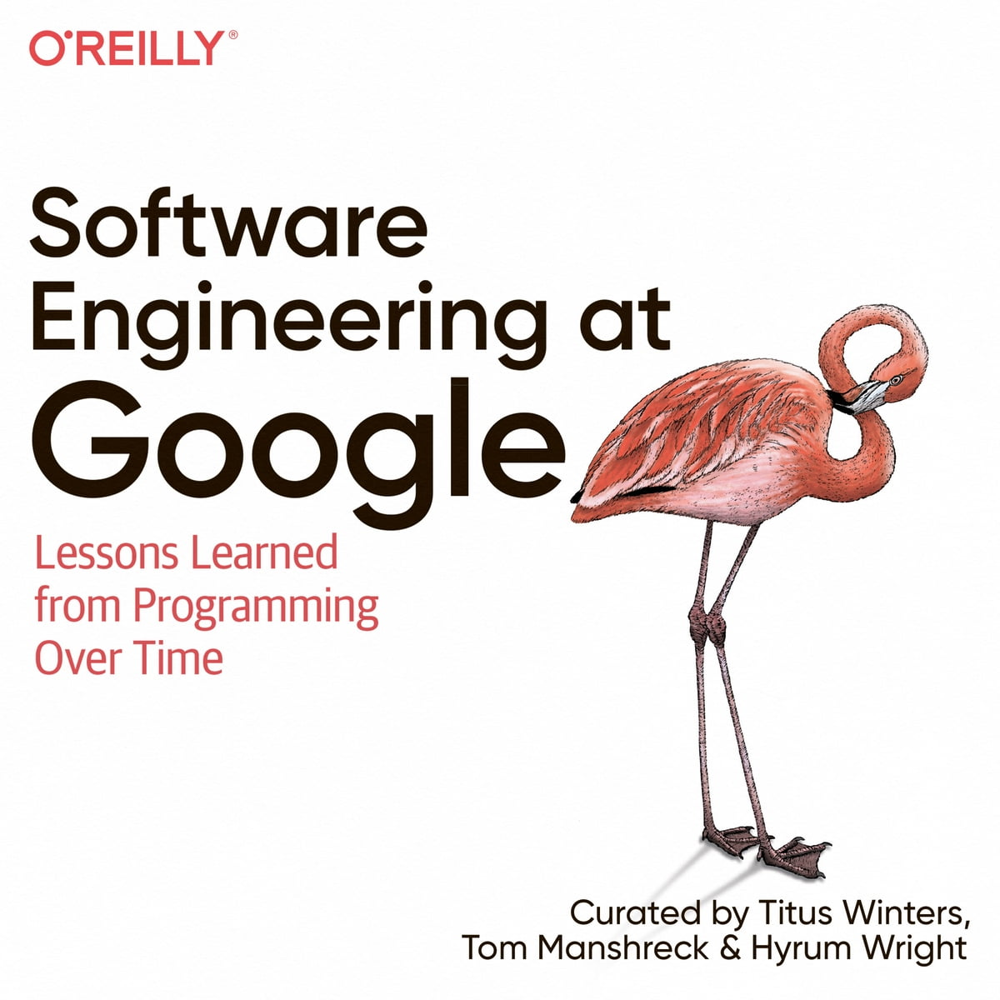
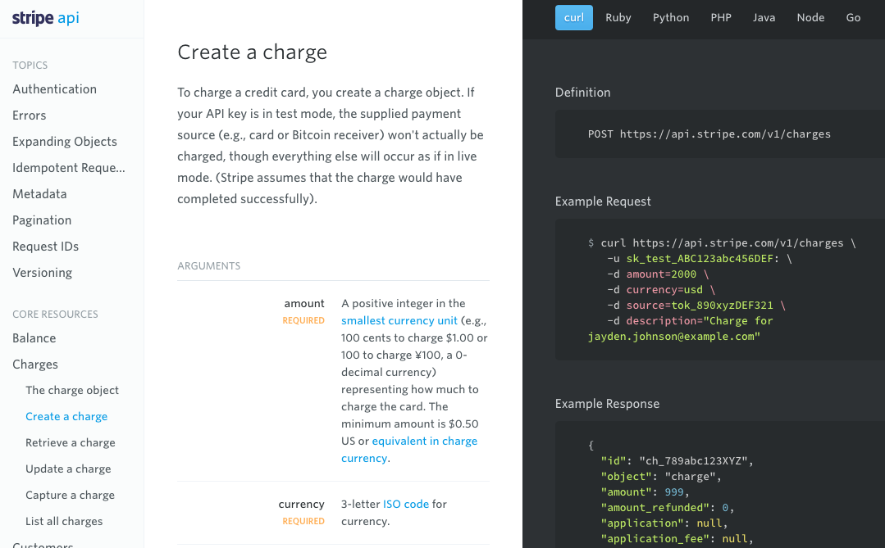

I just finished reading ["Software Engineering at Google"](https://www.goodreads.com/book/show/48816586-software-engineering-at-google), and I say I am very impressed by all the annotated material and recommendations of the book, I highly suggest to any software-enthusiast to pick up that book which is a true master-piece to our industry. I wanted to create summaries of the chapters I found to be very interesting, and so this chapter is one of the chapter-summary-series that I have prepared, which focuses on **Documentation**.

## What is Documentation?

Every supplemental text that an engineer needs to write to do their job, is defined as "Documentation". This entails not only standalone documents, but code comments as well. One interesting fact is that most of Google Documentation is in the form of code-comments, rather than standalone docs.



## Why is Documentation needed?

Quality documentation has tremendous benefits for an entgineering organization. Code and APIs become more comprehensible, reducing mistakes. Manual processes are easier to follow when the steps are clearly outlined. Onboarding new members to a team or code base takes much less effort if the process is documented. Unlike testing, documentation requires more effort upfront and doesn't provide clear benefits to an author until later. But like investements in testing, the investmeent made in documentation will pay for itself over time. You might write a document only once, but it will be read hundreds, perhaps thousands of time afterwards; its initial cost is amortized across all the future readers. Not only does documentation scale over time., but it is critical for the rest of the organization to scale as well. It helps answer the following questions:

- Why were these design decisions made?
- Why did we implement this code in this manner?
- Why did I implement this code in this manner, if you're looking at your own code two years later?

Given all these benefits, one might wonder why, in most of the cases, documentation is considered "poor" by engineers?

- Engineers often view writing as a separate skill than that of programming.
- Some engineers don't feel like they are capable writers.
- Writing documentation is often more difficult because of limited tools support or integration into developer workflow.
- Documentation is viewed as an extra burden - something else to maintain - rather than something that will make maintainance of the existing code easier.

In most of the cases however, engineers are perfectly capable of writing rich documentation. Documentation provides several benefits:

- It helps formulate an API.
- It provides a road map for maintenance and a historical record.
- It makes your code look more professional and drive traffic. Developers will naturally assume that a well-documrented API is a better-designed API. Whether a product has good documentation is usually a pretty good indicator of how well a product will be maintained.

## Documentation is like Code

Documentation is often so tightly coupled to code that it should, as much as possible, be treated as coded. That is, your documentation should:

- Have internal policies or rules to be followed
- Be placed under source control
- Have clear ownership responsible for maintaining the docs
- Undergo reviews for changes (and change with the code it documents)
- Have issues tracked, as bugs are tracked in code
- Be periodically evaluated (tested, in some respect)
- **If possible, be measured for aspects such as accuracy, freshness, etc.**

## `stale-md`

The authors describe that while Google has internally developed tools to "test" documentation freshness and accuracy, public tools have still not caught up in that domain. As such, I developed [stale-md](https://github.com/mkotsollaris/stale-md), a CircleCI orb that `greps` your markdown files and alerts whenever a certain markdown file has not been modified under a certain time. The `default` time range is 90 days, although you can easily modify according to your project to increase/decrease the range. Here's an example integration of `stale-md`:

```bash
version: 2.1

orbs:
  stale-md: mkotsollaris/stale-md@0.0.3
  orb-tools: circleci/orb-tools@11.1

jobs:
  scan:
    docker:
      - image: cimg/base:current
    steps:
      - checkout
      - stale-md/scan

workflows:
  main:
    jobs:
      - scan
```

While this is the first version of the project, I want to expand into a deeper code analysis and start analyzing code comments freshness. One of the most common issues I've indentified over my past experiences is that often times engineers update code but don't update code-comments in their commits. `stale-md` can help identify such cases in the future, so these comments don't end up being redudant post-commit.

## Audience

One of the most important mistakes that engineers make when writing documentation is to write only for themselves. It's natural to do so, and writing for yourself is not without value: after all, you might need to look at this code in a few years and try to figure out what you onmce meat. But if you write only for yourself, you are going to make certain assumptions, and given that your document might be read by a very wide audience (all of engineering, external developers), even a few lost reads is a large cost. As an organization grows, mistakes in documentation become more prominent, and your assumptions often do not apply.

Here are some types of audience criteria:

- Experience level (expert programmers, or junior engineers who might not even be familiar with the language)
- Domain knowledge (team members, or other engineers in your organization who are familiar only with API endpoints, or contracts)
- Purpose (end users who might need your API to do a specific task and need to find that information quickly, or software gurus who are responsible for the guts of a particularly hairy implementation that you hope no one needs to maintain).


Writing such documents is a balancing act and there's no silver bullet, but one thing that Google identified is that **short documents** tend to be far more readable that longer ones. Writig a short document often requires you to write a longer one (getting all information down) and then doing an edit pass, removing duplicate information where you can. As [Blaise Pascal](https://en.wikipedia.org/wiki/Blaise_Pascal) once said:

> _"If I had more time, I would have written you a shorter letter."_

__By keeping documents short and clear, you will ensure that it will satisfy both an expert and a novice.__

## Documentation Types

There are several main types of documents that software engineers often need to write - Reference documentation, including code comments:

- Design documents
- Tutorials
- Conceptual documentation
- Landing pages

Google suggests to keep documents to a singular purpose, and if adding something to that page doesn't make sense, you probably want to find, or even create, another document for that purpose. This is in the spirit of keeping documents as short as possible.

## Reference Documentation

Reference documentation is the most common type that engineers need to write. They often need to write some form of reference documents every day. The definition of reference documentation is anything that documents the usage of code within the codebase. Code comments are the most common form of reference documentation that engineers must maintain.

Most reference documentation, even when provided as separate documentation from the code, is generated from comments within the codebase itself. This is how Google achieves reference documentation in its libraries:

- a C++ API deserves to have its refenrece documentation live within the header file.
- Other reference documentation is embedded directly in the Java/Python/Go source code as well
- Because Google's Code Search browser (a tool that Google uses to search through its Codebase, something similar to [SourceGraph](https://about.sourcegraph.com/)) parses documentation, users can use such information to understand the full context of their searches during code search.

## "Good" code comments

We all know that code comments are essential to a well-documented API. But what's precisely a good comment? Pragmatically. there are two major audiences for reference documentation: seekers and stumblers. Seekers know what they want, stumblers don't. The key win for seekers is a consistenlty commented codebase so that they can quickly scan an API and find what they are looking from. The key win for stumblers is clearly identifying the purpose of an API, often at the top of a file header. Here's the following breakdown by comment-type:

### File Comments

Something quite surprising to me is that almost all code files at Google must contain a file comment. This is particoularly surprising as it contrasts the "Clean Code" [minimalist approach](https://softwareengineering.stackexchange.com/q/285787/200660), which is something along the lines of "write comments only if you absolutely need to". That being said, in the C++ world where there are header files, I can see this being easier to implement, as the sole purpose of [header files](https://www.learncpp.com/cpp-tutorial/header-files/) is to help compilers and engineers document implementation files. Hence, in C++ ecosystem, you can take a much more heavier documentation-approach than other ecosystems (for instance the JavaScript ecosystem).

Generally, a file comment should begin with an outline of what's contained in the code that's being read. It should identify the code's main use cases and intended audience. **Any API that cannot be succinctly described in the first paragraph or two is usually a sign of an API that is not well thought out**. It's suggested that the API needs to be broken down into seperate components if that's the case.

It's important to realize that in this example, Documentation can act as your north star of your architecture, as it might help you identify flaws during development.

### Class/Object/Types Comments

Class comments are important for defining the API "objects" in a codebase. ALl public classes must contain a class comment describing the construct, important methods of the class, and generally, the purpose of their existence.

## Function Comments

Function comments should generally begin with a comment of the following form:

```bash
// StrCat()
//
// Merges the given strings or numbers, using no delimiter(s),
// returning the merged result as a string.
```

Note that string a function comment with a declarative verb introduces consistency across a file. A seeker can quickly scan an API and read just the verb to get an idea of whether the function is appropriate: "Merges, Deletes, Creates" and so on.

## Documentation Reviews

All code needs to be reviewed, and as such, documentation needs review (athough this is less universally accepted). If you want to "test" whether your documentation works, you should generally have someone else review it.

A technical document benefits from three different types of reviews, each emphaaizing different aspects:

- A technical review, for accuracy. This review is usually done by a subject matter expert, often another member of your team. Often , this is part of a code review itself
- An audience review, for clarity. This is usually someone unfamiliar with the domain. This might be someone new to your team or a customer of your API.
- A writing review, for consistency. This is often a technical writer or volunteer.

Any document tends to benefit from the afoormentioned reviews, even if some of those reviews are ad hoc. That said, even getting one reviewer to review your text is preferrable to having no one review it.

## Deprecating Documents

Just like old code can cause problems, so can old documents. Over time, documents become stale, obsolete, or often abandoned.  Google examines freshness through their internal tool baked into their CI, something similar to [stale-md](https://github.com/mkotsollaris/stale-md) I mentioned earlier. Owners should strive to keep documentation as fresh as possible and up to date. That's who the rest of the team(s) can benefit by having reliable docs throughout their codebases.

## Conclusion

It's fascinating to realize all the possible different types of documentation. to change the quality of engineering documentation, engineers need to acvcept that they are both the problem and the solution. Rather than throw up their hands at the state of documentation, they need to realize that producing quality documentation is part of their job and saves them time and efforts in the long run. Here are a couple of TL;DRs:

- Documentation is hugely important over time and scale
- Documentation changes should leverage the existing developer workflow
- Keep documents focused **on one purpose**
- Write for your audience, not for yourself

## Afterword

["Software Engineering at Google"](https://www.goodreads.com/book/show/48816586-software-engineering-at-google) has been, by far, one of my recent favourite reads. In this article I tried to summarize as many of the crucial points, but of course, I highly advice that software enthusiasts should read this book, as it brings many exciting concepts and patterns surrounding software engineering. This is one of the chapters that intrigued my interest, and I will be writting on other exciting topics, including CI/CD, Depreciation, Dependency Management and more!