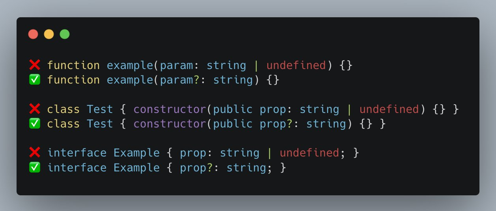

## Examples of using the `eslint-plugin-no-explicit-undefined` eslint rule

Let's take a look at some examples to better understand the difference between explicit undefined and implicit undefined using the optional operator:

❌ Explicit undefined:

```ts
function example(param: string | undefined) {}
class Test { constructor(public prop: string | undefined) {} }
interface Example { prop: string | undefined; }
```

✅ Implicit undefined with optional operator:

```ts
function example(param?: string) {} 
class Test { constructor(public prop?: string) {} }
interface Example { prop?: string; }
```

As you can see, the optional operator (?) makes the code cleaner and more expressive, giving a clear indication that a property is optional without explicitly mentioning undefined. You can find [the repository on Github](https://github.com/mkotsollaris/eslint-plugin-no-explicit-undefined).

## How to get started

🚀 Installation

Install the package using `npm`:

`npm install eslint-plugin-no-explicit-undefined --save-dev`

Install the package using `yarn`:

`yarn add eslint-plugin-no-explicit-undefined --dev`

Install the package using `pnpm`:

`pnpm install eslint-plugin-no-explicit-undefined --save-dev`

To configure the rule, add it to your ESLint configuration file (`.eslintrc.json`, `.eslintrc.js`, etc.):

```json
{
  "extends": ["custom"],
  "plugins": ["no-undefined-type-declaration"],
  "rules": {
    "no-undefined-type-declaration/no-undefined-type": "error"
  }
}
```

## The Redundant Undefined Problem

As I delved into the world of pull requests, I noticed a pattern of redundant undefined declarations in TypeScript code. This recurring issue made me realize that there was a need for a more elegant and cleaner way to handle optional properties.

Explicit undefined declarations not only added unnecessary noise to the code but also led to potential confusion and inconsistency among team members. I always ended up reviewing this certain type of error and I wanted to automate this, that's when I built [eslint-plugin-no-explicit-undefined](https://github.com/mkotsollaris/eslint-plugin-no-explicit-undefined).

## Embracing the Optional Operator (?)

The optional operator is a more concise and expressive way to handle optional properties in TypeScript. By using this operator, developers can indicate that a property might not exist or could be undefined, without explicitly mentioning it.

I realized that promoting the use of the optional operator (?) could bring multiple benefits to our projects:

- __Enhanced readability__: The optional operator makes the code more expressive and easier to understand, helping developers quickly grasp which properties are optional.
- __Consistent code style__: Adopting the optional operator establishes a consistent code style across the project, ensuring that all team members follow the same conventions.
- __Reduced complexity__: Using the optional operator helps avoid the need to explicitly handle undefined values, leading to a reduction in complexity and the potential for bugs caused by unexpected undefined values.

## In conclusion

The optional operator (`?`) is a powerful way to handle optional properties in TypeScript. By using implicit undefined instead of explicit undefined, you can improve your code's readability, maintainability, and consistency. 

Happy coding! 🚀
