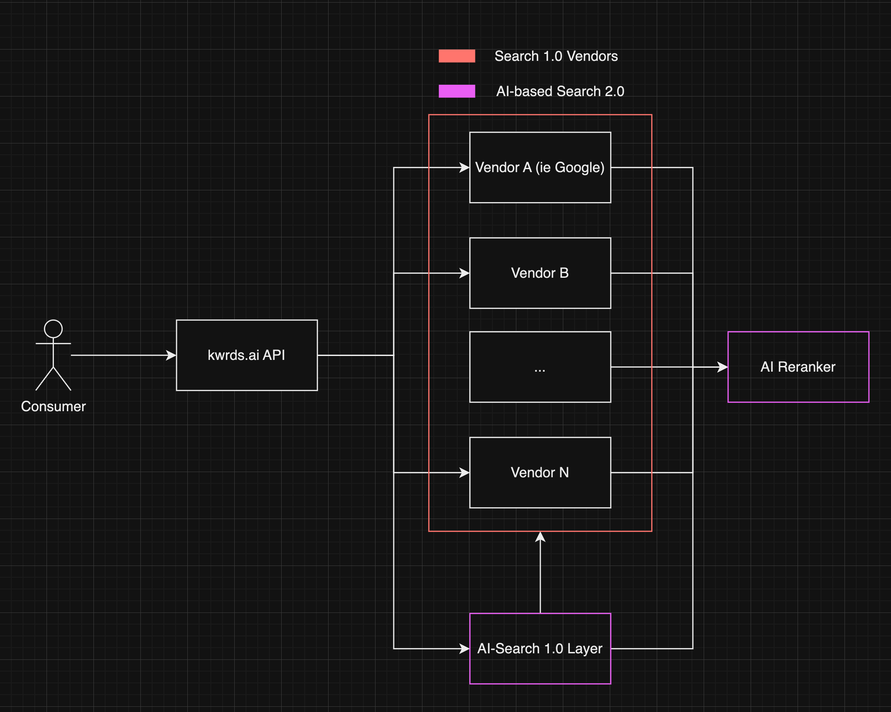

## Motivation

As I was chatting with my great colleague, [Konrad Butchardt](https://github.com/sundios), about the aparent hot topics in SEO, he descibed me the plethora of OSS work that he has executed in his past work. With the advent of AI technologies and the prominence of ChatGPT, it became evident that traditional SEO methodologies were becoming less effective. Recognizing the existing gap, we embarked on the development of [kwrds.ai](https://www.kwrds.ai).

## The problem

Historically, the SEO industry remained relatively stable. Tools like Semrush and keywordtool.io were standard for identifying trending keywords and formulating content strategies. They efficiently matched queries and provided results. However, AI's capability to discern intricate patterns presents a transformative opportunity for SEO. Consider the keyword "tesla". Traditional tools might offer [keyword volumes](https://en.wikipedia.org/wiki/Keyword_research), [cost per click (CPC)](https://www.investopedia.com/terms/c/cpc.asp), and [real user monitoring (RUM) data](https://en.wikipedia.org/wiki/Real_user_monitoring#:~:text=Real%20user%20monitoring%20(RUM)%20is,server%20or%20cloud%2Dbased%20application). But for SEO strategists, there's a demand for deeper insights: seed keywords, localized queries, and more. This depth was missing in existing tools, prompting our initiative to create one.

## How does it work

On the surface, our platform functions similarly to familiar tools: users input a keyword or phrase, specify parameters like region and language, and initiate a search. The results, ranked by volume, are sourced from industry leaders like Google and Microsoft. The distinction arises when users explore the AI-Research option after inputting a keyword, such as "tesla". This feature leverages the ChatGPT Language Model, extensively trained to produce content that resonates with human readers.

The efficacy of this model hinges on the quality of context provided. By integrating RUM data with advanced AI methodologies, we aim to deliver superior search results.

For a practical understanding, observe the demo for the "tesla" keyword:

The AI Reranker refines the search process further. It reorganizes data based on relevance and correlation. While keyword volumes are considered, the context might elevate a less popular keyword. The AI Reranker also filters out any mismatched keywords, ensuring precision.

## AI-based search in Multiple layers

We showcased how AI offers a dive-deep layer, but what about the initial search of generating relevant keywords? Turns out we can use AI during this step too, especially for identifying newer trends that haven't been indexed from Google.

As seen from the diagram, we can get valueable results during the initial search phase, and combine them with "Search 1.0" indexed results, derrive in highly relevant results where we can still "deep dive" into. AI results can be quite different from Search 1.0 results and can usually guide through significant untapped keywords. These insights could usually go unnoticed with Search 1.0 results, and hence having this layer is significant into having high quality results.

## Try it out

You can try kwrds.ai for free, give it a spin by visiting and share thoughts! The product is still under development and we are looking for important feedback as we are keep on iterating. Our goal is to create an immesive search experience that produces highly relevant search results by utilizing AI and RUM data. The product is free for the initial use, but after a while you need to pay to access AI-based features. If interested to try out, please contact me either through [twitter](https://twitter.com/mkotsollaris) or [email](mailto:mkotsollari@gmail.com), and I can provide you access to our [basic plan](https://www.kwrds.ai/pricing) with a 3-month free trial, no questions asked!