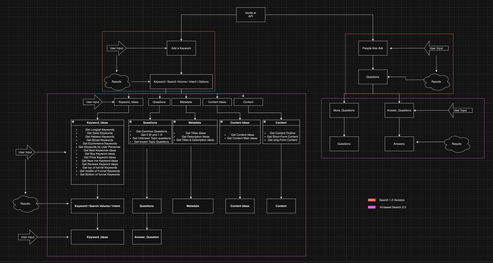

> "This article was originally posted in the [kwrds.ai Website](https://www.kwrds.ai/blog/introduction)"

## Introduction

As I was chatting with my great colleague, [Konrad Burchardt](https://github.com/sundios), about the aparent hot topics in SEO, he descibed me the plethora of OSS work that he has executed in his past work. With the advent of AI technologies and the prominence of ChatGPT, it became evident that traditional SEO methodologies were becoming less effective. Recognizing the existing gap, we embarked on the development of [kwrds.ai](https://www.kwrds.ai).

## The problem

Historically, the SEO industry remained relatively stable. Tools like Semrush and keywordtool.io were standard for identifying trending keywords and formulating content strategies. They efficiently matched queries and provided results. However, AI's capability to discern intricate patterns presents a transformative opportunity for SEO. Consider the keyword "tesla". Traditional tools might offer [keyword volumes](https://en.wikipedia.org/wiki/Keyword_research), [cost per click (CPC)](https://www.investopedia.com/terms/c/cpc.asp), and [real user monitoring (RUM) data](https://en.wikipedia.org/wiki/Real_user_monitoring#:~:text=Real%20user%20monitoring%20(RUM)%20is,server%20or%20cloud%2Dbased%20application). But for SEO strategists, there's a demand for deeper insights: seed keywords, localized queries, and more. This depth was missing in existing tools, prompting our initiative to create one.

## Search 1.0 and AI-based Search 2.0

With the advent of ChatGPT, the landscape of search has undergone a significant transformation. Traditional "Search 1.0" often operated under the assumption of linear time complexity, presupposing that users knew precisely what they were searching for. In this model, a specific input would yield a predictable output closely mirroring the original query.

Enter "Search 2.0" or AGI-based search. Here, user inputs are not strictly tied to outputs. Instead, additional contextual parameters come into play, allowing for more nuanced results. This approach is particularly beneficial for text-based data like keywords, where context is paramount for accurate interpretation.

Kwrds.ai doesn't aim to champion one approach over the other. Instead, our goal is to harmoniously integrate both, delivering precise data that empowers SEO managers in their content creation endeavors. Below is a high-level architecture illustrating the interplay between Search 1.0 and Search 2.0 within our platform:

A logical progression for our platform would be the dynamic generation of prompts based on contextual cues. For example, depending on the type of content users aim to produce, specific prompts could be crafted in real-time. This adaptability would be invaluable for users whose content strategies hinge on highly relevant SEO data.

## How does it work

On the surface, our platform functions similarly to familiar tools: users input a keyword or phrase, specify parameters like region and language, and initiate a search. The results, ranked by volume, are sourced from industry leaders like Google and Microsoft. The distinction arises when users explore the AI-Research option after inputting a keyword, such as "tesla". This feature leverages the ChatGPT Language Model, extensively trained to produce content that resonates with human readers.

The efficacy of this model hinges on the quality of context provided. By integrating RUM data with advanced AI methodologies, we aim to deliver superior search results.

For a practical understanding, observe the demo for the "tesla" keyword:

<CustomImage src="./kwrdsai_demo_tesla.gif" alt="kwrds.ai demo" />

The AI Reranker refines the search process further. It reorganizes data based on relevance and correlation. While keyword volumes are considered, the context might elevate a less popular keyword. The AI Reranker also filters out any mismatched keywords, ensuring precision.

## AI-based search in Layers

Beyond the deep insights AI offers, it also plays a pivotal role in the initial stages of keyword generation, identifying emerging trends even before they gain traction on platforms like Google.

The diagram illustrates the synergy between AI-generated insights and traditional "Search 1.0" results, culminating in a comprehensive search experience.

## Try it out

You can try kwrds.ai for free, give it a spin by visiting and share thoughts! The product is still under development and we are looking for important feedback as we are keep on iterating. Our goal is to create an immesive search experience that produces highly relevant search results by utilizing AI and RUM data. The product is free for the initial use, but after a while you need to pay to access AI-based features. If interested to try out, please contact me either through [twitter](https://twitter.com/mkotsollaris) or [email](mailto:mkotsollari@gmail.com), and I can provide you access to our [basic plan](https://www.kwrds.ai/pricing) with a 3-month free trial, no questions asked!